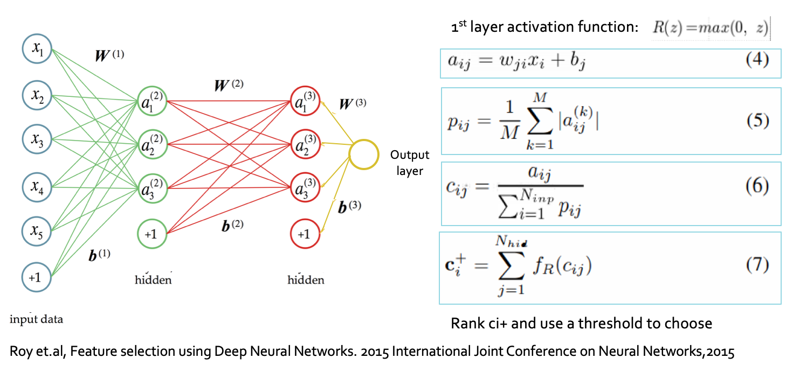
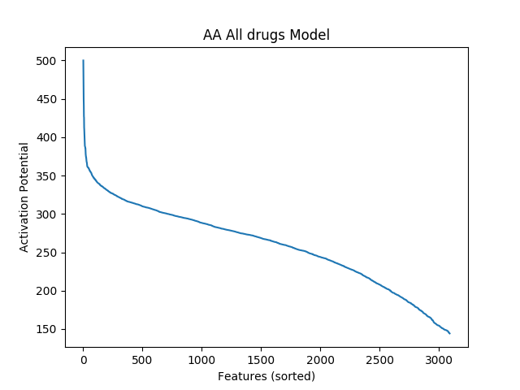
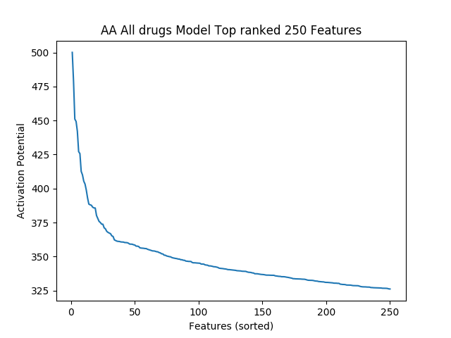
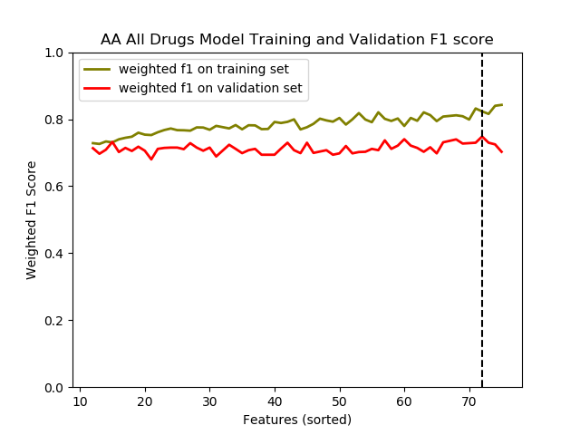

# Feature selection in neural network

This repo contains code in my publication [Factors associated with opioid cessation: a machine learning approach](https://www.biorxiv.org/content/10.1101/734889v1). The goal for the paper is to use different machine learning models to find a group of non-geneticc features that are the most predictive of opioid cessation.

Feature selection in neural network was done by evaluating the activation potential on the first layer. 

.

The activation potential of each input was ranked, from this graph we can see the activation potential starts to drop after the top 250 variables. 

.

Then we can zoom in the top 250 variables and see where did the drop occur exactly. 

.

The best set of variables were selected by evaluating groups of variables whose activation potentials were above certain threshold using cross validation. The set of variables that has the highest accuracy was chosen in the end. 

. 
